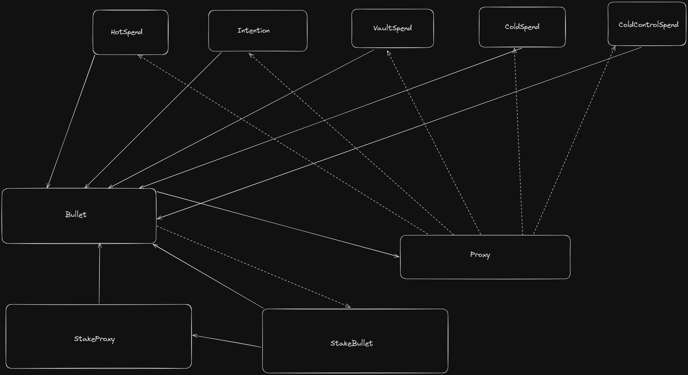

# account-abstraction
A series of micro-validators for account abstraction that are called via a proxy contract to have the cheapest cost for a user. 

## Building

```sh
aiken build
```

## Configuring

**aiken.toml**
```toml
[config.default]
network_id = 41
```

## Testing

You can write tests in any module using the `test` keyword. For example:

```aiken
use config

test foo() {
  config.network_id + 1 == 42
}
```

To run all tests, simply do:

```sh
aiken check
```

To run only tests matching the string `foo`, do:

```sh
aiken check -m foo
```

## Documentation

The account abstraction validator set called Bullet uses a series of link validators to reduce script ref size costs as well as using efficient coding practices to have low tx cost for each action. The contract offers many levels of safety customized to each users needs. Below is a diagram of the validators and how they link together



The straight lines represent a validator parameterized by the hash of the other validator it points to.
The dashed lines represents a validator link via a global state held by a datum or token name that is the hash of the validator being pointed to.

## Resources

Find more on the [Aiken's user manual](https://aiken-lang.org).
